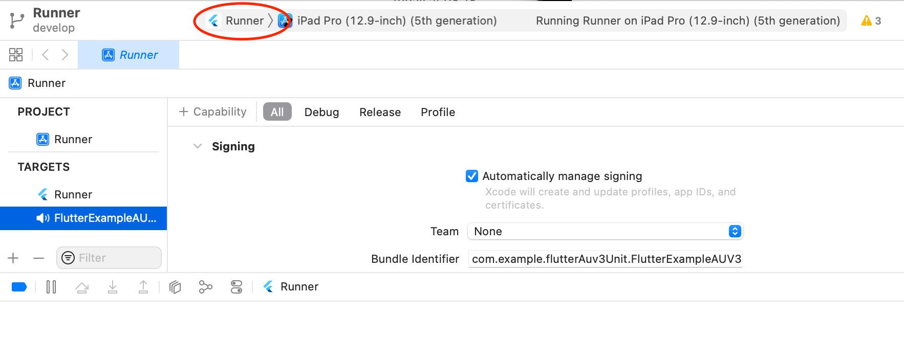
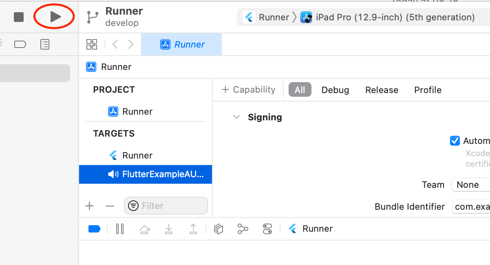
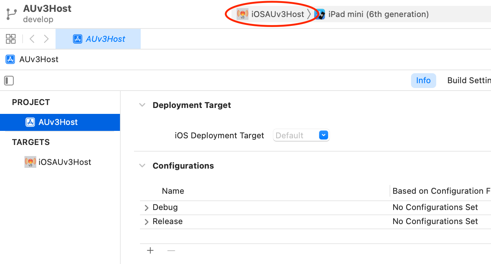
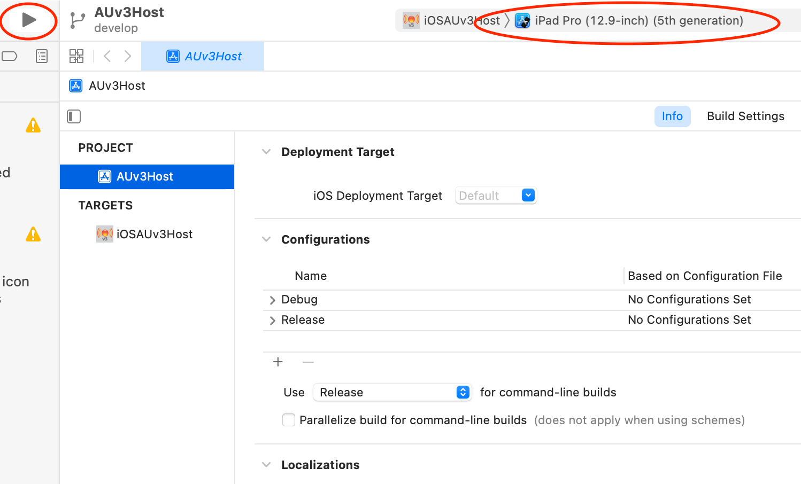
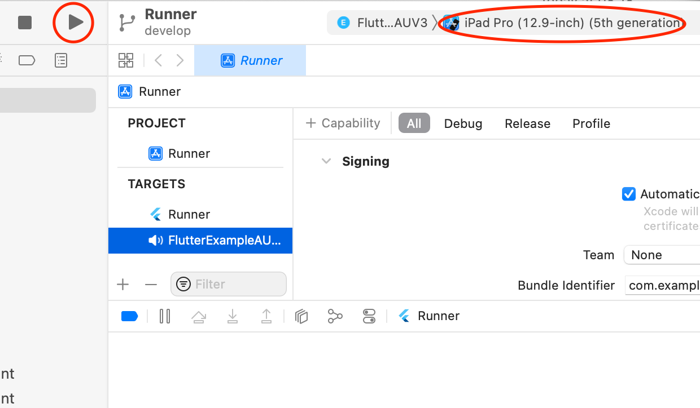
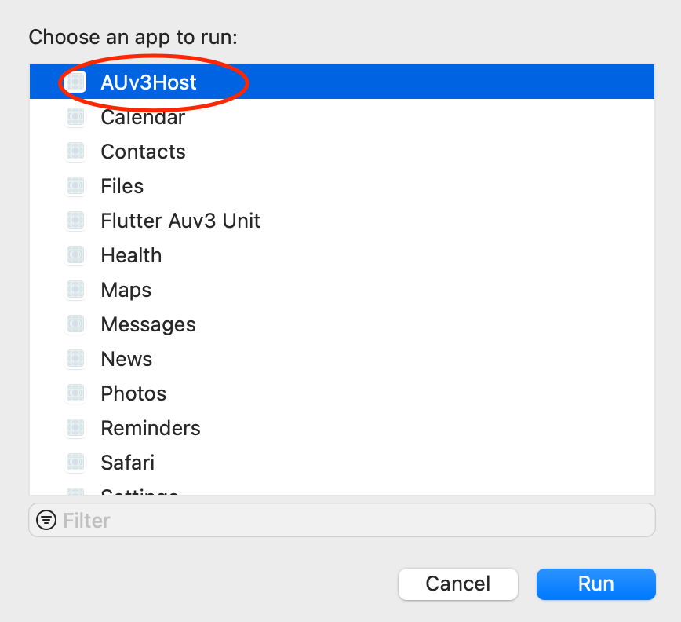
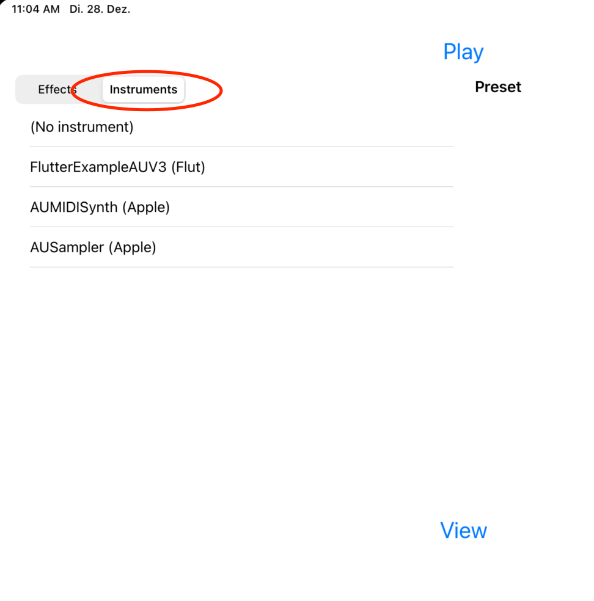
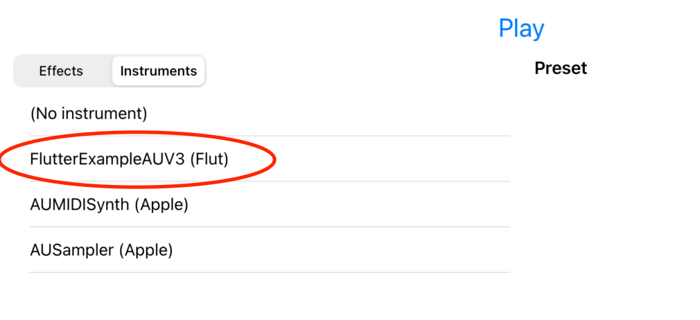
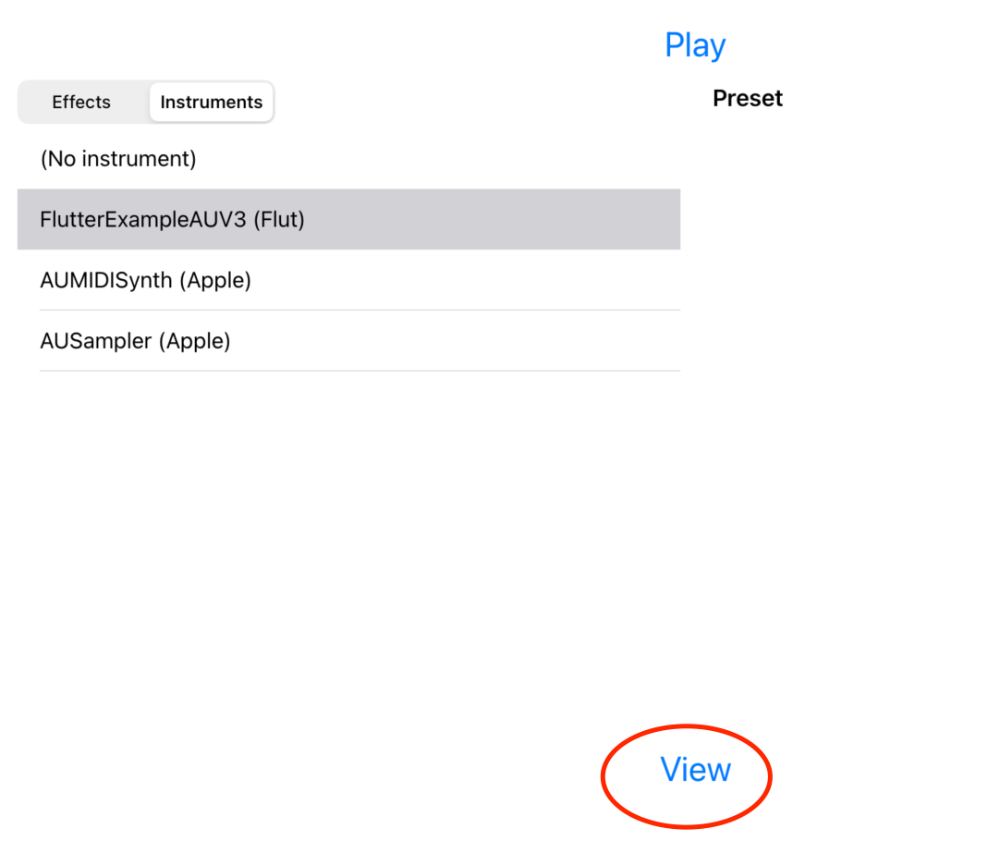
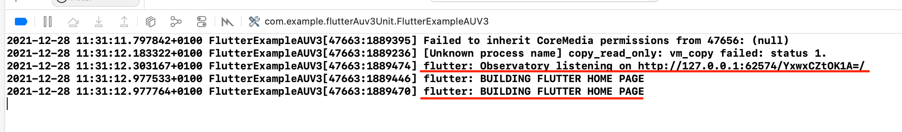

# Flutter AUv3 Audio Unit Error Demo

## Motivation

We are the developers of Audanika, a professional MIDI Controller app written in
Flutter. Many of our users require us to support Audio Unit Extensions (AUV3)
with Audanika.

https://www.youtube.com/watch?v=dV8p6LVJ3ms

## Goal

We want to be the first [Flutter based app, supporting Audio Unit Extensions](https://audanika.medium.com/help-us-to-implement-auv3-support-for-audanika-ea325870fa6a?source=friends_link&sk=9125551802c094e540e5aca073f535fe).

## Problems

Until now we were not able to show a Flutter view controller within an Audio
Unit Extensions

## Solution

We need support from the Flutter team, to help us to make FlutterViewController
work as part of an Audio Unit Extension. Here are the steps to reproduce the
issue:

### 1. Check out and prepare the repository

~~~bash
git clone git@github.com:gatzsche/flutter-audio-unit-extension-experiments.git
cd flutter-audio-unit-extension-experiments/
cd flutter_auv3_unit/
flutter pub get
~~~

## 2. Build and run the plugin container app

- Open `flutter_auv3_unit/ios/Runner.xcworkspace/` with Xcode.
- Select target `Runner`

  

- Run `Runner` on a chosen simulator

  

## 3. Build and run the plugin host app

- Open `AUV3Host/AUv3Host/AUv3Host.xcodeproj/` with Xcode
- Select `iOSAUv3Host` as target

  

- Run `iOSAUv3Host` on the same simulator the plugin container app was executed.

  

## 4. Debug the audio unit using the plugin host app

- Switch back to `flutter_auv3_unit/ios/Runner.xcworkspace/` Xcode project
- Select audio unit target `FlutterAUV3` 

  

- Run the plugin on the same simulator as before

  

- Select `AUv3Host` as the app to run

  

- Within AUv3Host: select the `Instruments` tab

  

- Select `Flutter Example Audio Unit`

  

- Wait three seconds
- Click on `View`

  

## 5. Here is the bug

- Normally the Flutter default app should be shown
- But you see only the red background of the FlutterViewController

## 6. Hints

- The commandline output shows that flutter is executed and also the widget tree is built. Probably the rendering does not work properly.

  
