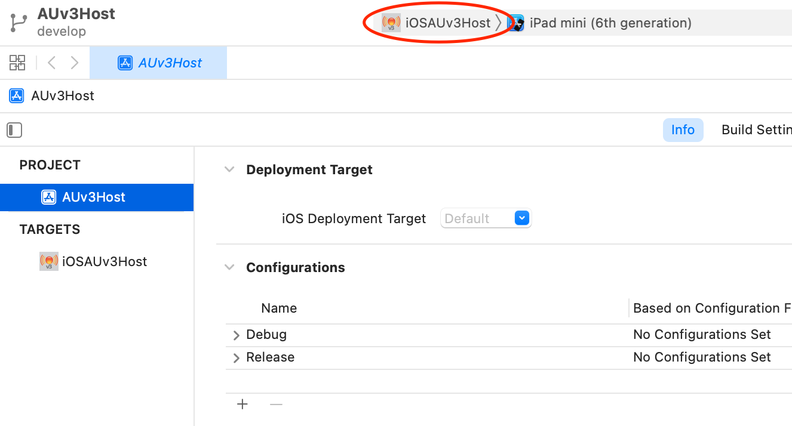
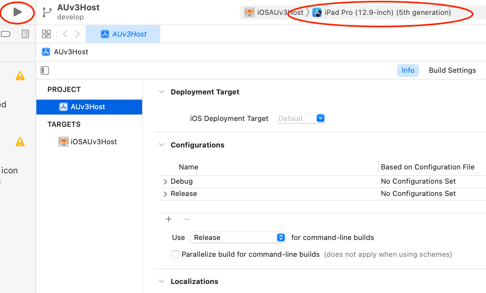
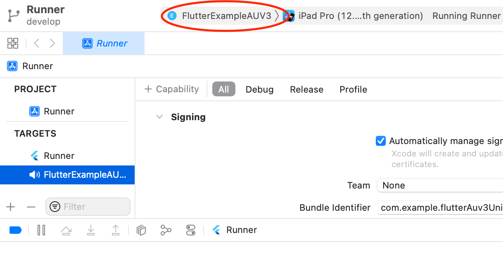
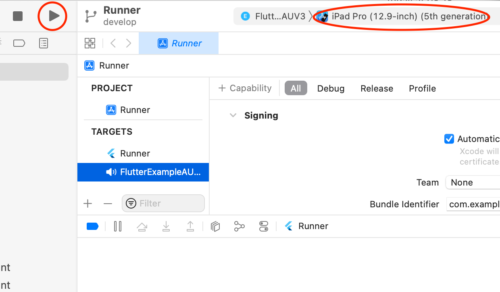
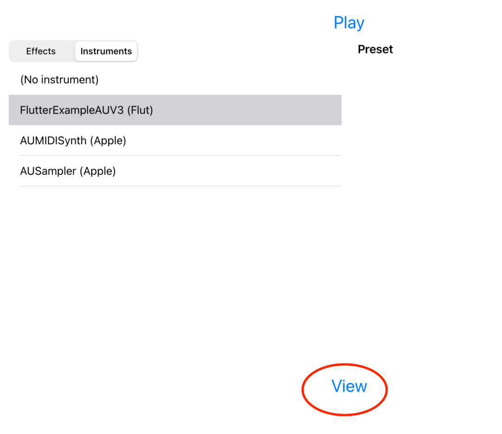

# Flutter AUv3 Audio Unit Experiments

Flutter has a huge potential also for audio- and music app development. This
project shows an Flutter based instrument audio unit.

## Overview

The following steps are needed to run the Audio Unit:

1. Build and run the plugin container app
2. Start the plugin host app
3. Debug the audio unit using the plugin host app

## 1. Build and run the plugin container app

- Open `flutter_auv3_unit/ios/Runner.xcworkspace/` with Xcode.
- Select target `Runner`

  

- Run `Runner` on a chosen simulator

  

## 2. Build and run the plugin host app

- Open `AUV3Host/AUv3Host/AUv3Host.xcodeproj/` with Xcode
- Select `iOSAUv3Host` as target

  

- Run `iOSAUv3Host` on the same simulator the plugin container app was executed.

  

## 3. Debug the audio unit using the plugin host app

- Switch back to `flutter_auv3_unit/ios/Runner.xcworkspace/` Xcode project
- Select audio unit target `FlutterAUV3` 

  

- Run the plugin on the same simulator as before

  

- Select `AUv3Host` as the app to run

  

- Within AUv3Host: select the `Instruments` tab

  

- Select `Flutter Example Audio Unit`

  

- Wait three seconds
- Click on `View`

  

## 4. Here is the bug

- Normally the Flutter default app should be shown
- But it is not.